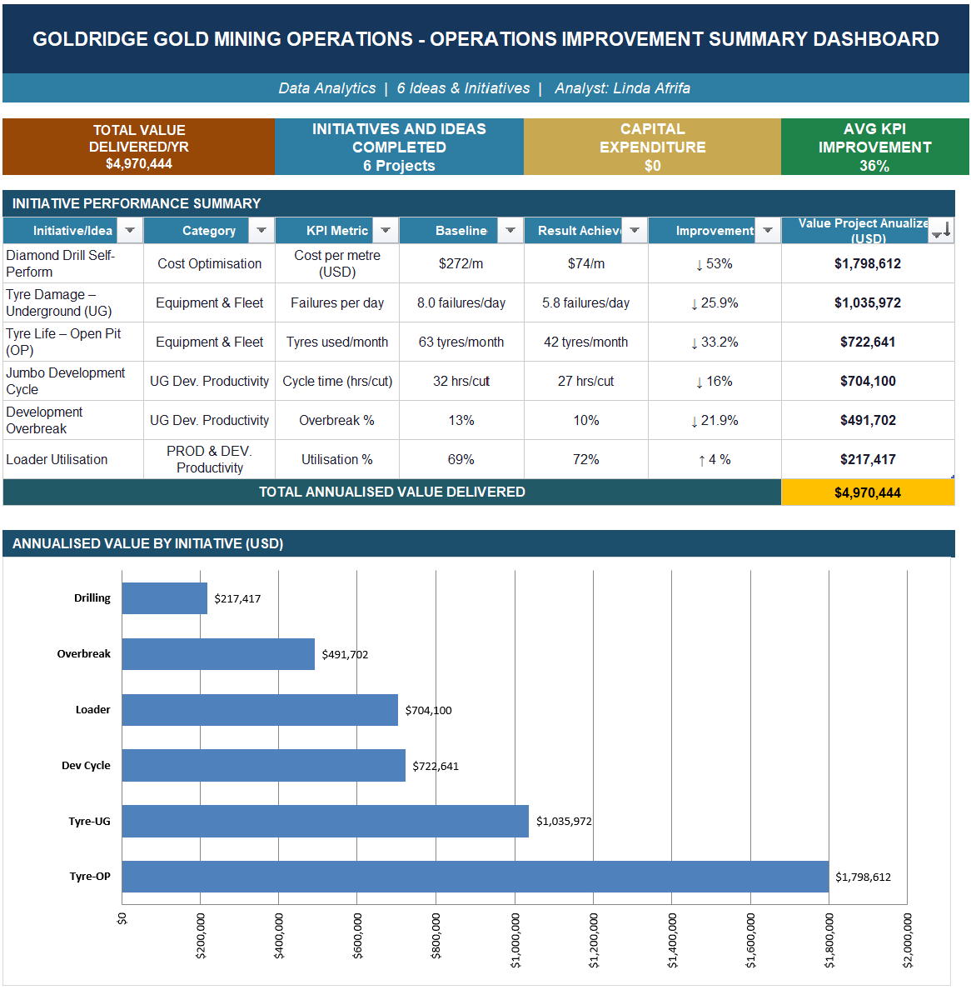
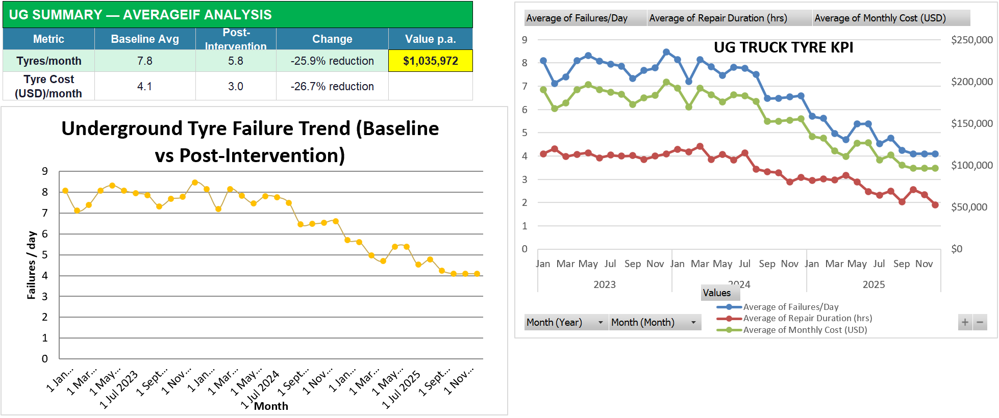

# Operational-Improvement-and-Data-Analytics-Portfolio
$4.97M in verified operational savings from real Gold Mine data - Data Analysis, Lean Six Sigma, Pareto analysis, stakeholder-led implementation.

---
## Overview
This portfolio presents six operational improvement case studies developed from Mine control data within a producing gold mining operation.
The project demonstrates how operational data can be transformed into measurable business outcomes through data analysis, KPI modelling, root cause investigation, stakeholder engagement, benefit tracking, and sustainability.

### Portfolio Summary
* 6 operational improvement initiatives
* $4.97M annualised business value
* $0 capital expenditure required
* 36% average KPI improvement
* Excel-based analytics and dashboard reporting
---
## Business Improvement Methodology
Structured framework used to identify, prioritize, implement, and sustain operational improvements through operational data analysis and quantified business benefits.
.

---
## Portfolio Projects

| Project                            | Focus Area                            | Annualised Value |
| ---------------------------------- | ------------------------------------- | ---------------- |
| Diamond Drill Self-Perform         | Cost Optimisation                     | $1.80M           |
| Underground Tyre Damage Reduction  | Equipment & Fleet Reliability         | $1.04M           |
| Open Pit Tyre Life Improvement     | Equipment & Fleet Reliability         | $723K            |
| Jumbo Drilling Cycle Reduction     | Underground Development Productivity  | $704K            |
| Development Overbreak Reduction    | Underground Development Productivity  | $492K            |
| LHD Loader Utilisation Improvement | Production & Development Productivity | $217K            |

---
## Dashboard Overview

Executive dashboard summarising six operational improvement initiatives and quantified business outcomes.

---

## Interactive Dashboard

Interactive Excel dashboard enabling before-and-after KPI comparisons across operational improvement initiatives using slicers and dynamic visualisations.
   

---

## KPI Analysis Example

Underground haul truck tyre performance analysis showing baseline versus post-intervention trends in failure rates, repair duration, and operating cost. Improvements were quantified using monthly KPI tracking and benefit calculations, identifying approximately $1.04M in annualised value.

---

## Skills Demonstrated

* Excel Dashboard Development
* KPI Modelling and Reporting
* Data Analysis and Visualisation
* PivotTables and Time-Series Analysis
* Business Case Quantification
* Value Driver Trees (VDTs)
* Root Cause Analysis
* Pareto Analysis and Fishbone Diagrams
* Lean Six Sigma and Continuous Improvement
* Process Mapping
* Benefit Tracking
* Stakeholder Management
* Operational Analytics
* Mine Control Data Interpretation

---

## Repository Contents

📄 Operational_Improvement_Portfolio_Summary_Linda_Afrifa.pdf
Executive summary describing the six initiatives, analytical methodology, and quantified outcomes.

📊 Goldridge_Mining_Operational_Improvement_Portfolio.xlsx
Excel workbook containing KPI analysis, dashboards, financial quantification models, and supporting operational datasets.

🖼️ Images
Dashboard screenshots and methodology visuals supporting the analysis.

---

## About the Data

This portfolio uses an anonymised case study ("Goldridge Mining Operations"). All company names, personnel, and site identifiers are fictional. The datasets, KPIs, and workflows reflect realistic mining operational environments while protecting confidential business information.

---

## Portfolio Purpose
The purpose of this portfolio is to demonstrate how operational data can be transformed into measurable business outcomes through structured analysis, continuous improvement methodologies, and data-driven decision-making.
The focus of the portfolio is the analytical process used to identify opportunities, quantify value, measure performance, and support operational improvements.

---

**Author:** Linda Afrifa
Geoscientist | Business Improvement Analyst | MSc Petroleum Geosciences, NTNU

LinkedIn: https://www.linkedin.com/in/linda-afrifa
